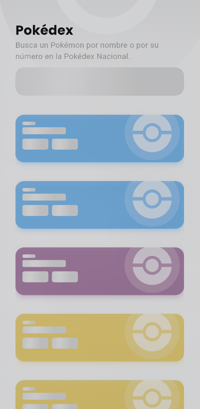

# Pokédex App

<div align="center">
  
  
  
  
</div>

## Descripción

Pokédex App es una aplicación moderna para dispositivos móviles desarrollada con Flutter que ofrece información detallada sobre Pokémon. Inspirada en la Pokédex de la serie original, esta aplicación permite a los usuarios explorar, buscar y conocer estadísticas, evoluciones y características de todos los Pokémon.

## Arquitectura

Este proyecto implementa **Clean Architecture** para mantener un código organizado, testeable y escalable:

### Estructura del proyecto

```
lib/
  ├── core/                      # Componentes centrales reutilizables
  │   ├── constants/             # Constantes globales
  │   ├── error/                 # Manejo de errores
  │   ├── network/               # Configuración de red
  │   ├── router/                # Configuración de rutas
  │   ├── services/              # Servicios globales
  │   ├── theme/                 # Configuración de tema
  │   └── utils/                 # Utilidades generales
  │
  ├── features/                  # Características organizadas por dominio
  │   └── pokemon/               # Módulo de Pokémon
  │       ├── data/              # Capa de datos
  │       │   ├── datasources/   # Fuentes de datos (API, local)
  │       │   ├── models/        # Modelos de datos
  │       │   └── repositories/  # Implementaciones de repositorios
  │       │
  │       ├── domain/            # Capa de dominio (casos de uso)
  │       │   ├── entities/      # Entidades de dominio
  │       │   ├── repositories/  # Interfaces de repositorios
  │       │   └── usecases/      # Casos de uso
  │       │
  │       └── presentation/      # Capa de presentación
  │           ├── bloc/          # Gestión de estado (BLoC)
  │           ├── constants/     # Constantes de presentación
  │           ├── pages/         # Páginas/vistas
  │           └── widgets/       # Widgets reutilizables
  │
  └── main.dart                  # Punto de entrada de la aplicación
```

### Patrones y Principios

- **Clean Architecture**: Separación clara de responsabilidades en capas
- **BLoC Pattern**: Gestión de estado reactiva y predecible
- **Repository Pattern**: Abstracción de fuentes de datos
- **Dependency Injection**: Inyección de dependencias usando GetIt
- **Single Responsibility**: Cada clase tiene una única responsabilidad
- **SOLID Principles**: Aplicación de principios de diseño SOLID

## Características principales

- **Listado de Pokémon**: Visualización de todos los Pokémon con carga infinita
- **Búsqueda**: Filtro por nombre o número
- **Detalles de Pokémon**:
  - Información básica (altura, peso)
  - Estadísticas (HP, ataque, defensa, etc.)
  - Tipos y debilidades
  - Cadena evolutiva interactiva
- **Diseño visual avanzado**:
  - Tarjetas con efecto de sombra triple
  - Fondos con gradiente según el tipo de Pokémon
  - Animaciones (rotación de Pokeball, efectos de escala)
  - Efecto de partículas decorativas
  - Transiciones Hero

## Sistema visual

### Paleta de colores

La aplicación utiliza una paleta de colores dinámica basada en los tipos de Pokémon:

- **Normal**: `#919AA2` (Gris moderno)
- **Fuego**: `#FF4C29` (Rojo fuego vibrante)
- **Agua**: `#3A86FF` (Azul oceánico)
- **Planta**: `#38B000` (Verde vibrante)
- **Eléctrico**: `#FFB800` (Amarillo eléctrico)
- **Hielo**: `#48CAE4` (Azul hielo)
- **Lucha**: `#D62828` (Rojo agresivo)
- **Veneno**: `#8338EC` (Púrpura intenso)
- **Tierra**: `#AC7C5F` (Marrón tierra)
- **Volador**: `#6096BA` (Azul cielo)
- **Psíquico**: `#EF476F` (Rosa vibrante)
- **Bicho**: `#7CB518` (Verde insecto)
- **Roca**: `#6B705C` (Gris rocoso)
- **Fantasma**: `#5E548E` (Púrpura fantasma)
- **Dragón**: `#2D00F7` (Azul dragón intenso)
- **Siniestro**: `#353535` (Negro moderno)
- **Acero**: `#6C757D` (Gris acero)
- **Hada**: `#E0218A` (Rosa fairy intenso)

### Constantes de diseño

El proyecto implementa un sistema centralizado de constantes en `presentation_constants.dart`:

- **PresentationConstants**: Valores globales (padding, border radius, opacidades)
- **PokemonCardConstants**: Constantes específicas para las tarjetas
- **PokemonDetailConstants**: Constantes para la página de detalle
- **PokemonTypeConstants**: Constantes para los chips de tipos
- **EvolutionChainConstants**: Constantes para las cadenas evolutivas
- **AppTexts**: Textos reutilizables para toda la aplicación

## Tecnologías utilizadas

- **Flutter**: Framework principal de desarrollo
- **Dart**: Lenguaje de programación
- **BLoC/Cubit**: Gestión de estado
- **GoRouter**: Navegación y enrutamiento
- **Dio**: Cliente HTTP para consumo de API
- **CachedNetworkImage**: Gestión de caché de imágenes
- **Google Fonts**: Tipografía personalizada
- **Shimmer**: Efectos de carga
- **Equatable**: Comparación eficiente de objetos

## API utilizada

El proyecto consume la API de [PokéAPI](https://pokeapi.co), una API RESTful gratuita y abierta que proporciona datos completos sobre Pokémon:

- Información sobre especies de Pokémon
- Estadísticas y tipos
- Imágenes oficiales
- Cadenas evolutivas
- Y mucho más

## Instalación y configuración

1. Clona el repositorio:
```bash
git clone <url-del-repositorio>
```

2. Navega al directorio del proyecto:
```bash
cd Flutter-Clean-Arquitecture-Pokedex
```

3. Instala las dependencias:
```bash
flutter pub get
```

4. Ejecuta la aplicación:
```bash
flutter run
```

## Próximas mejoras

- Implementación de modo oscuro
- Favoritos y almacenamiento local
- Comparación de Pokémon
- Optimización de rendimiento
- Pruebas unitarias y de widgets
- Soporte para búsqueda avanzada (por tipo, habilidad, etc.)

---

Desarrollado con ❤️ usando Flutter y [PokéAPI](https://pokeapi.co)
